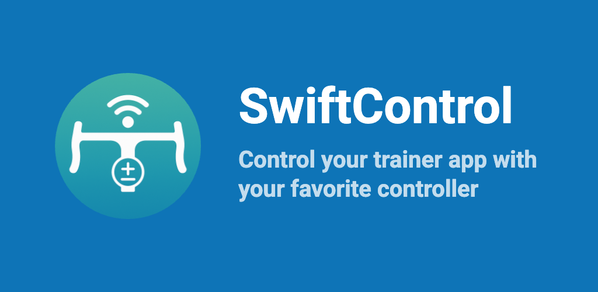

# SwiftControl

## Description

With SwiftControl you can **control your favorite trainer app** using your Zwift Click, Zwift Ride or Zwift Play devices. Here's what you can do with it, depending on your configuration:
- Virtual Gear shifting
- Steering / turning
- adjust workout intensity
- control music on your device
- more? If you can do it via keyboard, mouse or touch, you can do it with SwiftControl

https://github.com/user-attachments/assets/1f81b674-1628-4763-ad66-5f3ed7a3f159

## Downloads
Check the compatibility matrix below!

## Supported Apps
- MyWhoosh
- TrainingPeaks Virtual / indieVelo
- Biketerra.com (they do offer native integration already - check it out)
- Rouvy (most Zwift devices are already supported by Rouvy)
- any other! You can add custom mapping and adjust touch points or keyboard shortcuts to your liking

## Supported Devices
- Zwift Click
- Zwift Click v2 (mostly, see issue #68)
- Zwift Ride
- Zwift Play
- Elite Sterzo Smart (beta)
- Elite Square Smart Frame (beta)
- Wahoo Kickr Bike Shift (beta)

## Supported Platforms

Follow this compatibility matrix. It all depends on where you want to run your trainer app (e.g. MyWhoosh on):

| Run Trainer app (MyWhoosh, ...) on: | Possible | Link                                                                                                                                                                                                                                                        | Information                                                                                                                                                                                                                                                                                                                                                                                                                            |
|-------------------------------------------------------------|----------|-------------------------------------------------------------------------------------------------------------------------------------------------------------------------------------------------------------------------------------------------------------|----------------------------------------------------------------------------------------------------------------------------------------------------------------------------------------------------------------------------------------------------------------------------------------------------------------------------------------------------------------------------------------------------------------------------------------|
| Android                                                     | ✅        |  |                                                                                                                                                                                                                                                                                                                                                                                                                                        |
| iPad                                | ✅        |                                  | You will need to use SwiftControl as a "remote" to control the trainer app on your iPad. Typically you would use an iPhone or an Android phone for that.                                                                                                                                                                                                                                                                               |
| Windows                                                     | ✅        |                                                                                                                                                                        | - Windows may flag the app as virus. It likely does so because the app controls the mouse and keyboard. - Bluetooth connection unstable? You may need to use an [external Bluetooth adapter](https://github.com/jonasbark/swiftcontrol/issues/14#issuecomment-3193839509). - Make sure your Zwift device is not paired with Windows Bluetooth settings: [more information](https://github.com/jonasbark/swiftcontrol/issues/70). |
| macOS                                                       | ✅        |                                 |                                                                                                                                                                                                                                                                                                                                                                                                                                        |
| iPhone                                                      | ❌        |                                                                                                                                                                                                                                                              | Note that you can't run SwiftControl and your trainer app on the same iPhone due to iOS limitations, but you can use it to remotely control MyWhoosh and similar on e.g. an iPad.                                                                                                                                                                                                                                                      |
| Apple TV | ❌ | | Apple TV does not support touch inputs. Instead you can use e.g. SwiftControl with MyWhoosh Link to control your session |

For testing purposes you can also run it on [Web](https://jonasbark.github.io/swiftcontrol/) but this is just a tech demo - you won't be able to control other apps.

## Troubleshooting
Check the troubleshooting guide [here](TROUBLESHOOTING.md).

## How does it work?
The app connects to your Zwift devices automatically. It does not connect to your trainer itself.

- **Android**: SwiftControl uses the AccessibilityService API to simulate touch gestures on specific parts of your screen to trigger actions in training apps. The service monitors which training app window is currently active to ensure gestures are sent to the correct app.
- **iOS**: use SwiftControl as "remote control" for other devices, such as an iPad. Example scenario:
  - your phone (Android/iOS) runs SwiftControl and connects to your Zwift devices
  - your iPad or other tablet runs e.g. MyWhoosh (does not need to have SwiftControl installed)
  - after pairing SwiftControl to your iPad / tablet via Bluetooth your phone will send the button presses to your iPad / tablet
- **macOS** / **Windows** a keyboard or mouse click is used to trigger the action. 
  - there are predefined Keymaps for MyWhoosh, indieVelo / Training Peaks, and others
  - you can also create your own Keymaps for any other app
  - you can also use the mouse to click on a certain part of the screen, or use keyboard shortcuts

## Alternatives
- [qdomyos-zwift](https://www.qzfitness.com/) directly controls the trainer (as opposed to controlling the trainer app). This can be useful if your trainer app does not support virtual shifting.

## Donate
Please consider donating to support the development of this app :)

- [via PayPal](https://paypal.me/boni)
- [via Credit Card, Google Pay, Apple Pay, etc (USD)](https://donate.stripe.com/8x24gzc5c4ZE3VJdt36J201)
- [via Credit Card, Google Pay, Apple Pay, etc (EUR)](https://donate.stripe.com/9B6aEX0muajY8bZ1Kl6J200)
